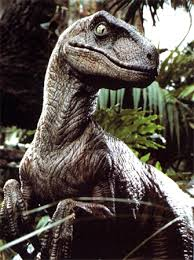

# Introduction

The jarrod-prefs document classes define a style based on my own publishing formatting preferences. The introduction should be three parts. One, a hook stating the problem or condition that this study relates. Generally that part should be broad and general. The second part is the problematization of the first part that we will address (e.g. We don't have any empirical studies to support policy x). The final part should state our solution to the problem, the hypothesis, our approach to solving the problem, the result, and a summary of the layout of the article.

# Literature

In this section, there will likely be a bunch of citations. Full citation: [@Olson16072014]. For no author: [-@Olson16072014]. To make for more natural writing, a full citation can be done in line. @Olson16072014 note that if suspense was the only factor contributing to fan utility, a larger playoff would actually result in decreased revenue.

# Methods

It is likely that in the methods section, there will be a need to show an equation. Math notation from Latex is rendered into a figure and printed into the Word Doc, e.g.:

$$\frac{d}{dx}\left( \int_{0}^{x} f(u)\,du\right)=f(x).$$

# Results

More than likely in the results section, a number of figures and tables will be needed. Figures are pretty straightforward.


```{r, fig.cap = "Sepal length vs. petal length, colored by species"}
library(ggplot2)
qplot(Sepal.Length, Petal.Length, data = iris, color = Species)
```

Note the use of the `fig.cap` chunk option to provide a figure caption. You can adjust the proportions of figures using the `fig.width` and `fig.height` chunk options. These are specified in inches, and will be automatically scaled down to fit within the handout margin.

Tables do not render properly in a word doc. Using the knitr::kable option will generate a workable table, but you will need to manually alter it. Easiest transformation is to select all on the table, right click, select "Table" and then for sizing set it to relative (100%).

```{r}
knitr::kable(head(mtcars[,1:6]), 'pandoc')
```

# Discussion

In the discussion, we talk only about the interpretation of results and how we believe it impacts the field. We also discuss the shortcomings of the study. For example, if there is a reason (e.g. a velociraptor) that the results may be slightly biased, maybe we would show a picture of a velociraptor.



# Conclusion

Finally, in the conclusion, we summarize each of the preceeding 4 sections. This is an opportunity to wrap up the analysis in a pretty little bow.

# Appendix - Style Notes

## Headings

This style provides standard headings through a fifth level.

# References

Unfortunately references are printed at the very end, so they have to go here.